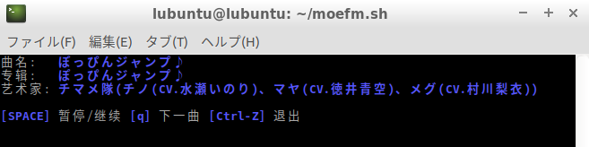
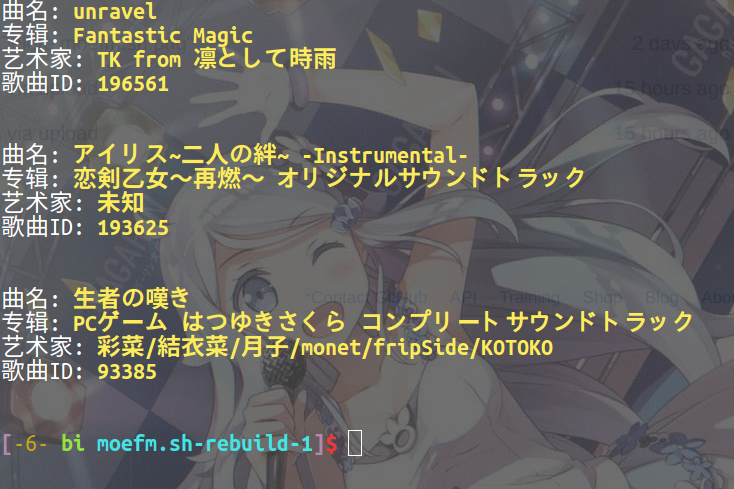
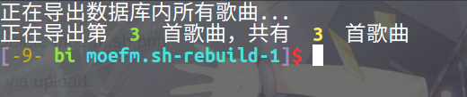
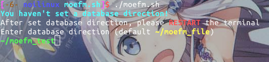
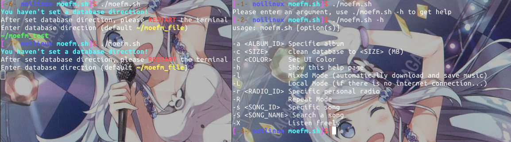
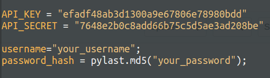

# 萌否电台bash脚本客户端

用终端听[萌否电台](http://moe.fm)。

[](#安装和使用)



## 安装

Lubuntu / Ubuntu:

```bash
sudo apt-get install mpg123 curl jq git wget mp3info python3 python3-pip		 

pip3 install pylast
```

OSX (with [Homebrew](https://brew.sh/)):

```
brew install mpg123 curl jq wget mp3info
```

执行:


```bash
git clone https://github.com/mike2718/moefm.sh.git
cd moefm.sh
./moefm.sh
```

第一次执行会要求设定数据库位置



请输入合适的路径('~'会被自动转义)
或直接回车

之后请打开一个新的终端进行操作



如果需要使用Last.fm的同步功能，请修改scrobble.py		


## 参数

moefm.sh:
```bash
./moefm.sh -X
# 随机播放一些歌曲

./moefm.sh -s 191459
# 播放song_id为191459的歌曲
# 相当于网页播放 http://moe.fm/listen/h5?song=191459

./moefm.sh -a 40276
# 播放album_id为40276的整张专辑
# 相当于 http://moe.fm/music/40276 

./moefm.sh -D 191459
# 将song_id为191459的歌曲下载到本地数据库中

/moefm.sh -F 191459
# 在Last.fm 上收藏song_id为191459的歌曲

./moefm.sh -S "ぽっぴんジャンプ♪"
# 搜索这首歌曲并播放

./moefm.sh -l
# 混合模式，听歌的同时会保存歌曲到本地

./moefm.sh -L
# 离线模式，在本地数据库搜索歌曲（仅支持 -S 选项）

# 如果既没有 -l，也没有-L，为常规模式，
# 从网络上下载元数据并在本地检索，若存在歌曲即用本地文件播放，
# 不存在则用网络播放，但不保存到本地

./moefm.sh -C red
# 改变粗体字的颜色，
# 参数可以是black, red, green, yellow, blue, magenta, cyan和white
# 默认为蓝色

./moefm.sh -R
# 循环播放

./moefm.sh -U		
# 自动将所听的歌曲发布到Last.fm上		

./moefm.sh -h
#显示参数表
```

moedatabase.sh
```bash
./moedatabase.sh -c 100
# 将本地的音乐文件清理至 100MB 以下

./moedatabase.sh -e "unravel"
# 将包含"unravel"的歌曲从数据库中导出

./moedatabase.sh -E
# 将数据库中的所有歌曲导出

./moedatabase.sh -d "unravel"
# 将包含"unravel"的歌曲从数据库中删除

./moedatabase.sh -D
# 清空数据库

./moedatabase.sh -O "~/moe_export"
# (与-e/-E一起使用) 设置导出的路径，默认为~/moefm_export

./moedatabase.sh -S "unravel"
# 搜索并列出数据库中包含"unravel"的歌曲


./moedatabase.sh -h
# 显示帮助
```

## 快捷键

* `s` `SPACE`: 暂停/继续播放
* `q` `Ctrl-C`: 跳到下一首曲目
* `Ctrl-Z`: 退出

## 小技巧
* 在.bashrc中添加```bash alias moefm='moefm -C "yellow" -U '```以自动改变UI颜色和同步歌曲
* 播放本地数据库的所有歌曲```bash moefm -S "#" -L


## 使用协议
[MIT](https://github.com/mike2718/moefm.sh/blob/master/LICENSE)
