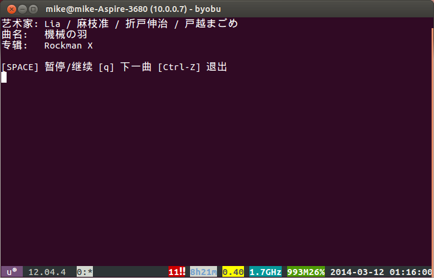

moefmcmd.sh
===========

运行在Ubuntu上的[萌否电台](http://moe.fm)bash脚本客户端。可以用终端听萌否电台唷~。

[](#安装和使用)
 
## 安装和使用 ##

在Ubuntu的终端上，执行

```bash
sudo apt-get install mpg123 curl jq
git clone git@github.com:mike2718/moefmcmd.git
cd moefmcmd
chmod 755 moefmcmd.sh
./moefmcmd.sh
```

## 快捷键  ##

* `s` `SPACE`: 暂停/继续播放
* `q` `Ctrl-C`: 跳到下一首曲目
* `Ctrl-Z`: 退出

## 更便利的使用方法 ##

变成随处可运行的客户端。

```bash
cd moefmcmd
mkdir ~/bin
cp moefmcmd.sh ~/bin
. ~/.bashrc
moefmcmd.sh
```
## 依赖软件 ##

* [mpg123](http://www.mpg123.de/)
* [curl](http://curl.haxx.se/)
* [jq](http://stedolan.github.io/jq/)

